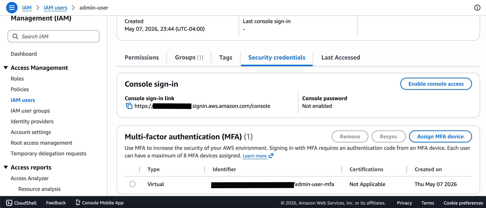
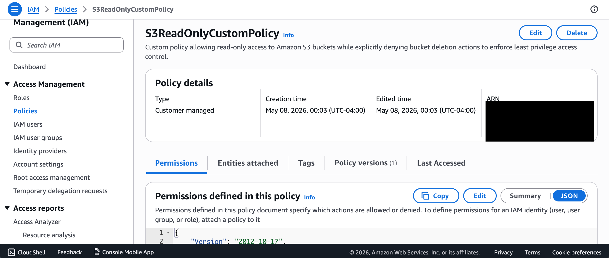
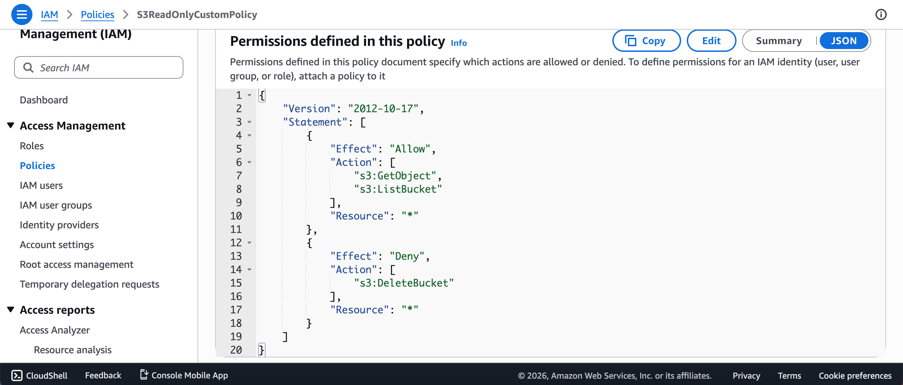
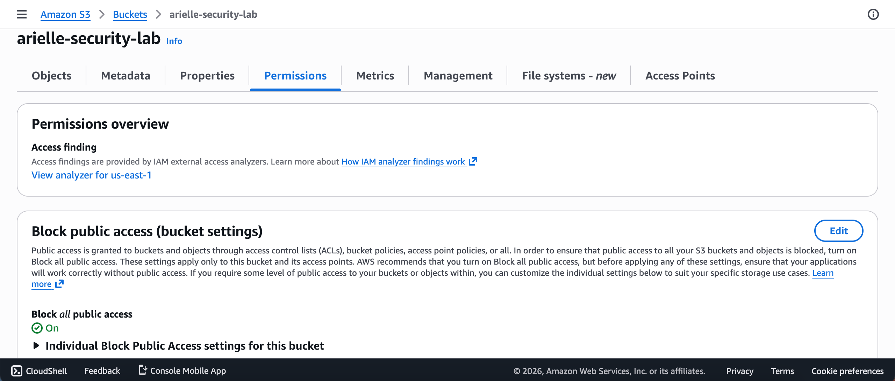
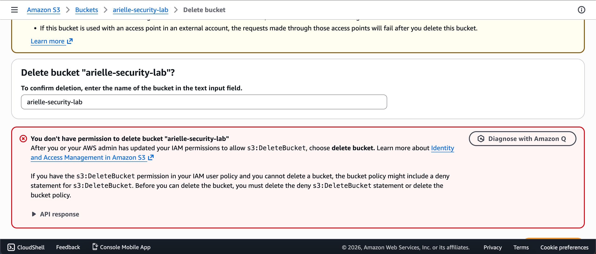
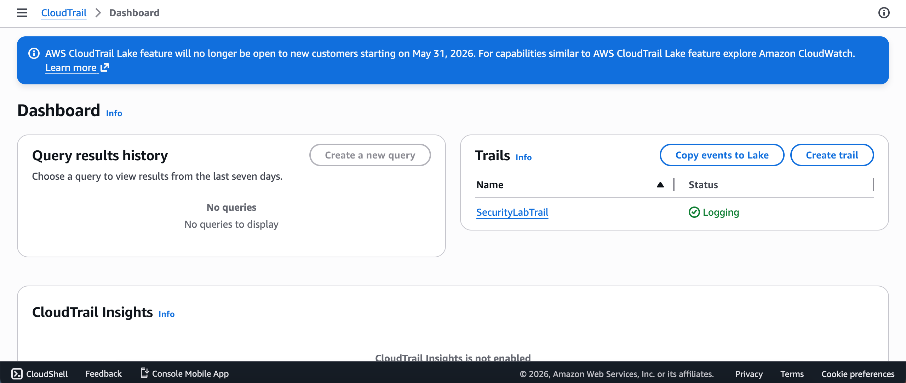
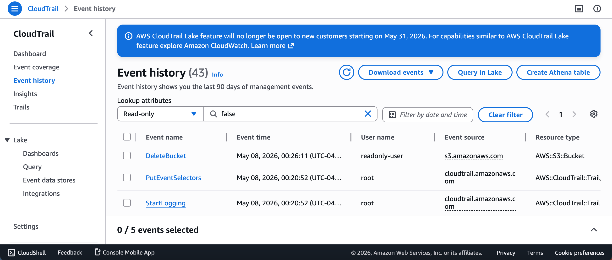

# AWS Cloud Security Lab

## Overview
This project demonstrates hands-on AWS cloud security concepts using Identity and Access Management (IAM), Amazon S3, multi-factor authentication (MFA), and CloudTrail logging.

The lab focuses on implementing least privilege access controls, securing cloud storage resources, and monitoring user activity through AWS logging services.

---

## Objectives
- Implement role-based access control (RBAC)
- Enforce least privilege access
- Configure multi-factor authentication (MFA)
- Secure S3 bucket permissions
- Monitor user activity using CloudTrail

---

## Technologies Used
- AWS IAM
- Amazon S3
- AWS CloudTrail
- JSON IAM Policies
- MFA (Multi-Factor Authentication)

---

## Security Features Implemented
- Created IAM users and groups
- Configured custom least privilege IAM policies
- Enabled MFA for IAM users
- Blocked public access to S3 buckets
- Tested permission restrictions using access denial validation
- Enabled CloudTrail logging and event monitoring

---

## Project Artifacts
- IAM user and MFA configuration
- Custom least privilege IAM policy
- S3 bucket security configuration
- Access control testing
- CloudTrail logging and monitoring

---

## Screenshots

### IAM MFA Enabled

### Custom Policy Overview

### S3 Read-Only Policy JSON

### S3 Public Access Blocked

### Access Denied DeleteBucket Test

### CloudTrail Dashboard

### CloudTrail Event History

---

## Key Takeaways
- Learned AWS IAM and access management fundamentals
- Applied least privilege security principles
- Configured cloud logging and monitoring using CloudTrail
- Gained hands-on experience with AWS cloud security controls
